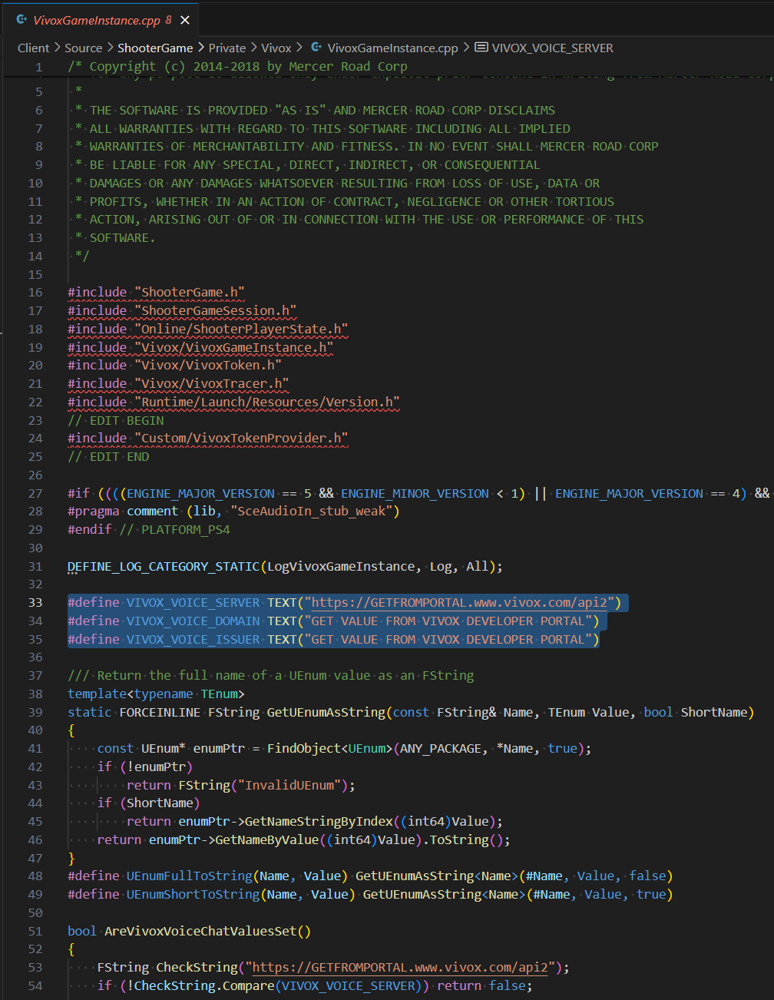
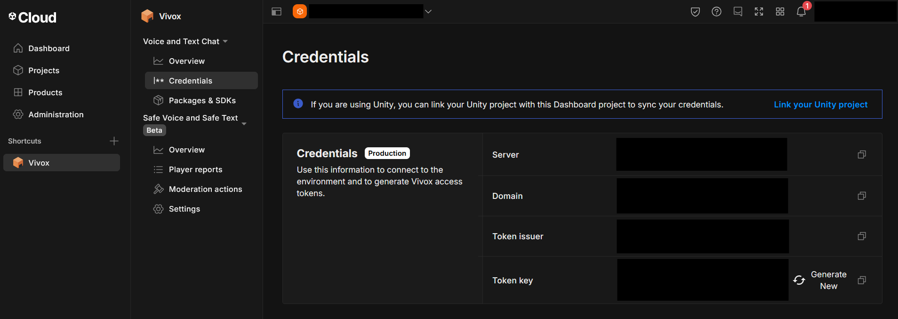
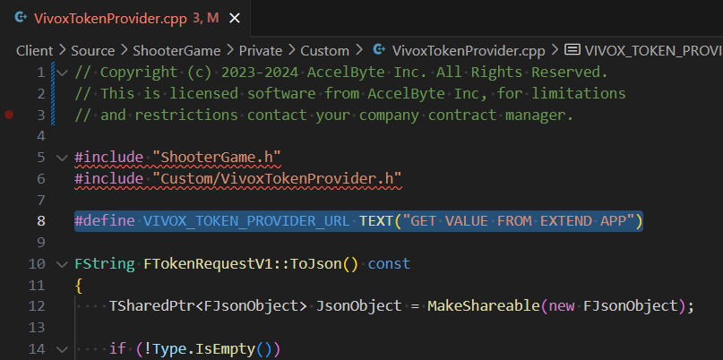
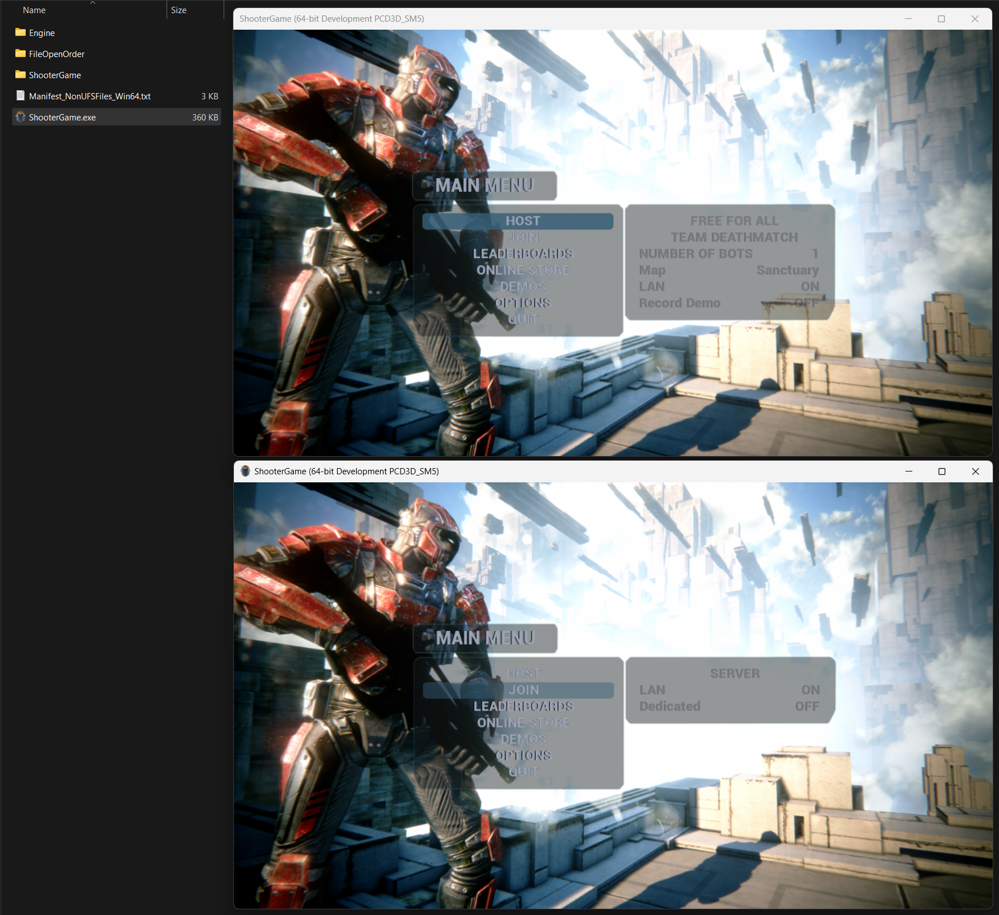
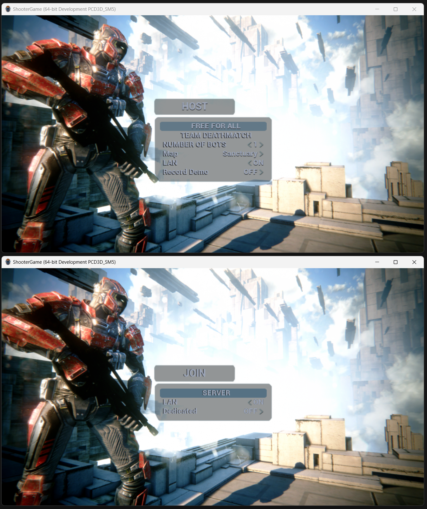
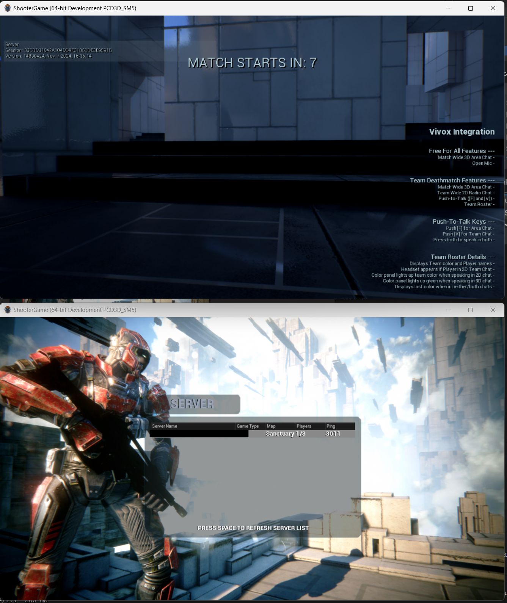
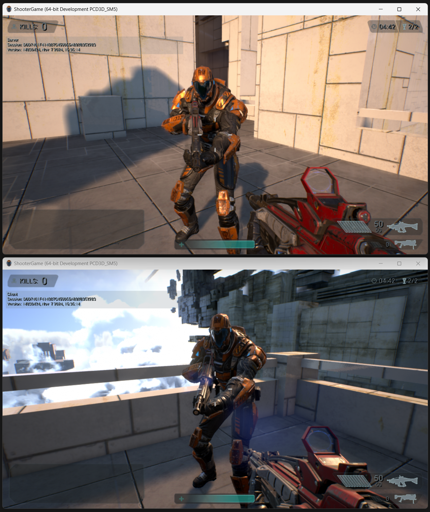

# Extend RTU Vivox Sample Game Unreal

## Prerequisites

* Unreal Engine 4.26

## How to use

0. (Optional) There's an example [Vivox Authentication Server](Server) included in this repository. You can run it using `make run`. (do not forget to create a `.env` file)

1. Set the values for `VIVOX_VOICE_SERVER`, `VIVOX_VOICE_DOMAIN`, `VIVOX_ISSUER` in the [VivoxGameInstance.cpp](Client/Source/ShooterGame/Private/Vivox/VivoxGameInstance.cpp) file with values that are found in the Vivox Credentials in your Unity Dashboard project.

    

    

2. Set the value for `VIVOX_TOKEN_PROVIDER_URL` in the [VivoxTokenProvider.cpp](Client/Source/ShooterGame/Private/Custom/VivoxTokenProvider.cpp)

    

3. Open the [Unreal project](Client/ShooterGame.uproject).

4. Build the Unreal project. (`File / Package Project / Windows (64-bit)`)

5. Launch 1 or more instances of the build. (`ShooterGame.exe`)

    

6. Have 1 client host and others join.

    

    

    